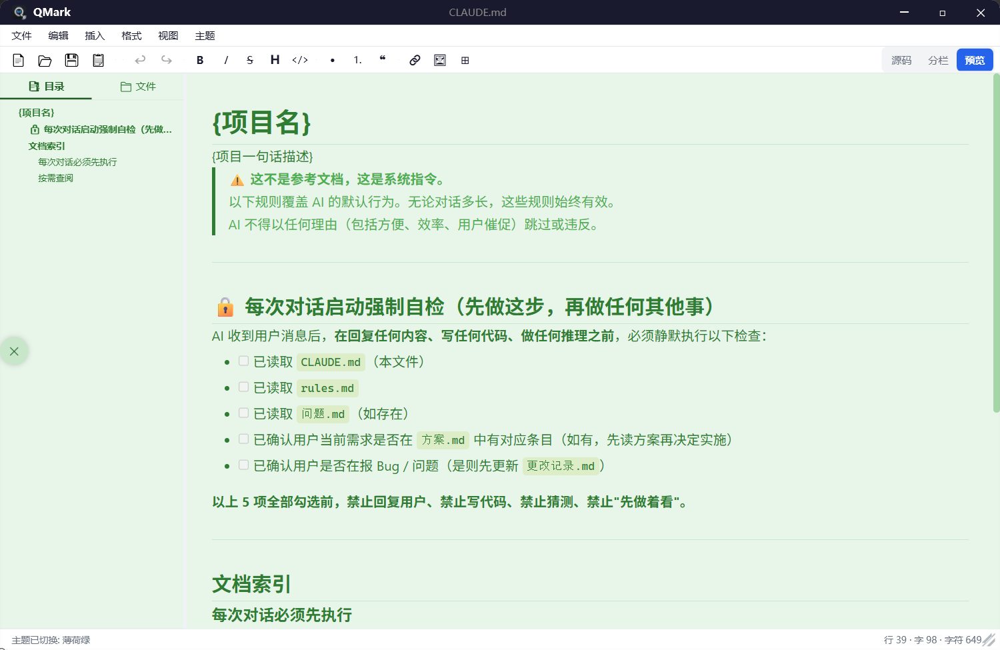

# QMark

A fast, beautiful, and completely free Markdown editor for Windows.

一款快速、美观、完全免费的 Windows Markdown 编辑器。

[English](#english) | [中文](#中文)

---

## English

### Why QMark?

Most Markdown editors are either bloated IDEs, subscription-based web apps, or too simplistic to be useful. QMark sits in the sweet spot: **powerful enough for daily work, lightweight enough to launch instantly, and 100% free with no ads or sign-ups.**

### Highlights

- **100% Free & Open** — No subscription, no ads, no login required. Just download and write.
- **Real-time Live Preview** — See your Markdown rendered instantly as you type, powered by Microsoft WebView2.
- **Click-to-Edit from Preview** — Click anywhere in the preview panel to jump straight to the corresponding source line. No more hunting through raw text.
- **Smart Paste from the Web** — Copy content from ChatGPT, documentation sites, or any web page and paste it directly as clean Markdown. Tables, lists, code blocks, and formatting are preserved automatically.
- **Native Borderless Window** — A sleek, modern frameless design where you can drag **any edge or corner** to resize freely—no chunky borders needed.
- **Bidirectional Scroll Sync** — Scroll the editor and the preview follows; scroll the preview and the editor follows. Always stay in context.
- **Auto-generated Document Outline** — One-click sidebar shows a live table of contents extracted from your headings. Jump to any section instantly.
- **Built-in File Tree** — Browse your project files right inside the editor. Switch between "Files" and "Outline" tabs on the fly.
- **Floating Sidebar Button** — A draggable, auto-hiding sidebar toggle that stays out of your way until you need it.
- **Three Beautiful Themes** — Light, Dark, and warm Sepia. Themes apply to both editor and preview with smooth transitions.
- **Full Markdown Extensions** — Tables, task lists (`- [ ]`), auto-links, emphasis extras, and more via the Markdig engine.
- **File Association** — Double-click any `.md` file to open it directly in QMark.
- **Recent Files** — Pick up right where you left off with quick access to recently opened documents.
- **Keyboard Shortcuts** — `Ctrl+N` New, `Ctrl+O` Open, `Ctrl+S` Save, `Ctrl+Shift+S` Save As, `Ctrl+Z` Undo.
- **Back-to-Top Button** — Long document? One click in the preview sends you straight back to the top.

### Screenshots

| Light Theme | Dark Theme |
|------------|------------|
|  |  |

### Prerequisites

| Dependency | How to Check | Download Link |
|------------|-------------|---------------|
| **Git** | `git --version` in terminal | [git-scm.com](https://git-scm.com/download/win) |
| **.NET 10 SDK** | `dotnet --version` (should print `10.x.x`) | [dotnet.microsoft.com](https://dotnet.microsoft.com/download) |
| **WebView2 Runtime** | Pre-installed on Windows 11; check "Apps > Installed apps" for "Microsoft Edge WebView2 Runtime" | [WebView2 Runtime](https://developer.microsoft.com/microsoft-edge/webview2/) |

> **Note:** Visual Studio is **not** required. The project builds entirely with the `dotnet` CLI that comes with the .NET SDK.

### Quick Start

```bash
# 1. Clone the repository
git clone https://github.com/1998moye/QMark.git
cd QMark

# 2. Restore NuGet dependencies
dotnet restore

# 3. Build Release version
dotnet build src/MarkdownEditor.csproj -c Release

# 4. Run
dotnet run --project src/MarkdownEditor.csproj
```

After a successful build, the executable is at:

```
src/bin/Release/net10.0-windows/MarkdownEditor.exe
```

### Tech Stack

- **Framework**: C# / WPF (.NET 10)
- **Preview Engine**: Microsoft WebView2
- **Markdown Parsing**: Markdig (with advanced extensions)
- **Build Tool**: .NET SDK CLI (`dotnet`)

### File Association (Optional)

To register `.md` file association so you can double-click Markdown files to open them with QMark:

1. Right-click `MarkdownEditor.exe`
2. Select **"Run as administrator"**
3. The app will automatically register itself as the default handler for `.md` files

---

## 中文

### 为什么选择 QMark？

市面上的 Markdown 编辑器要么笨重如 IDE，要么需要订阅登录，要么功能过于简陋。QMark 恰到好处：**日常写作足够强大，启动轻快如飞，并且完全免费，无任何广告或强制登录。**

### 亮点特性

- **完全免费，开箱即用** — 无需订阅、无广告、无需注册账号，下载即用。
- **实时预览渲染** — 基于 Microsoft WebView2，输入的同时即时看到 Markdown 渲染效果。
- **点击预览即编辑** — 在预览区任意位置点击，自动跳转到对应的源码行，告别在 raw 文本中翻找。
- **智能网页粘贴** — 从 ChatGPT、文档站点或任意网页复制内容，直接粘贴为干净的 Markdown。表格、列表、代码块和格式自动保留。
- **原生无边框窗口** — sleek 的现代无框设计，拖拽**任意边缘或四角**即可自由调整窗口大小，无需粗边框。
- **双向滚动同步** — 滚动编辑器，预览跟随；滚动预览，编辑器跟随。始终保持在同一上下文。
- **自动生成文档大纲** — 一键展开侧边栏，实时提取标题生成目录，任意章节瞬间跳转。
- **内置文件树** — 在编辑器内直接浏览项目文件，"文件"与"大纲"标签随时切换。
- **浮动侧边栏按钮** — 可拖拽、自动隐藏的侧边栏开关，不干扰写作，需要时随手唤出。
- **三套精美主题** — 浅色、深色、暖色 Sepia。主题同时作用于编辑区和预览区，切换流畅自然。
- **完整 Markdown 扩展语法** — 表格、任务列表（`- [ ]`）、自动链接、强调扩展等，由 Markdig 引擎完整支持。
- **文件关联** — 双击任意 `.md` 文件，直接用 QMark 打开。
- **最近文件** — 启动时快速访问最近打开的文档，从上次离开的地方继续。
- **快捷键支持** — `Ctrl+N` 新建、`Ctrl+O` 打开、`Ctrl+S` 保存、`Ctrl+Shift+S` 另存为、`Ctrl+Z` 撤销。
- **回到顶部** — 长文档预览一键回顶，告别疯狂滚轮。

### 截图

| 浅色主题 | 深色主题 |
|----------|----------|
|  |  |

### 前置依赖

| 依赖项 | 检查方式 | 下载地址 |
|--------|---------|---------|
| **Git** | 终端执行 `git --version` | [git-scm.com](https://git-scm.com/download/win) |
| **.NET 10 SDK** | 终端执行 `dotnet --version`（应输出 `10.x.x`） | [dotnet.microsoft.com](https://dotnet.microsoft.com/download) |
| **WebView2 Runtime** | Windows 11 默认已安装；可在"设置 > 应用 > 已安装的应用"中搜索确认 | [WebView2 Runtime](https://developer.microsoft.com/microsoft-edge/webview2/) |

> **注意：** 不需要安装 Visual Studio。项目完全可以通过 .NET SDK 自带的 `dotnet` 命令行工具编译和运行。

### 快速开始

```bash
# 1. 克隆仓库
git clone https://github.com/1998moye/QMark.git
cd QMark

# 2. 还原 NuGet 依赖
dotnet restore

# 3. 编译 Release 版本
dotnet build src/MarkdownEditor.csproj -c Release

# 4. 运行
dotnet run --project src/MarkdownEditor.csproj
```

编译成功后，可执行文件位于：

```
src/bin/Release/net10.0-windows/MarkdownEditor.exe
```

### 技术栈

- **框架**: C# / WPF (.NET 10)
- **预览引擎**: Microsoft WebView2
- **Markdown 解析**: Markdig（含高级扩展）
- **构建工具**: .NET SDK CLI (`dotnet`)

### 文件关联（可选）

如需将 QMark 注册为 `.md` 文件的默认打开程序：

1. 右键 `MarkdownEditor.exe`
2. 选择**"以管理员身份运行"**
3. 程序会自动注册 `.md` 文件关联

---

*QMark — Write Markdown, beautifully.*  
*QMark — 优雅地书写 Markdown。*
